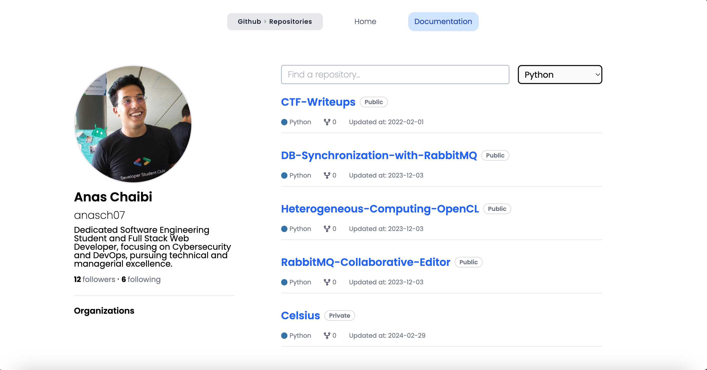

# Github User Repository Browser

A responsive Next.js application that allows users to search for a GitHub user and view their repositories. Users can filter repositories by search query and/or primary language.
####  🚨 Check It Live
Website: [https://github-repositories-with-search-functionality.vercel.app/](https://github-repositories-with-search-functionality.vercel.app/)





## 🚀 How to Run

`npm install`
`npm run dev`

### You will need to create a .env file in the root directory with the following contents:

```
NEXT_PUBLIC_GITHUB_GRAPHQL=https://api.github.com/graphql
GITHUB_ACCESS_TOKEN=YOUR_TOKEN
```
You can create a GitHub access token by following the instructions [here](https://docs.github.com/en/github/authenticating-to-github/keeping-your-account-and-data-secure/creating-a-personal-access-token).

## 🧪 How to test
`npm run test`


## 🏗️ Tech Stack

<details open>
  <summary>Frontend</summary>
  <ul>
    <li><a href="https://emotion.sh/">TailwindCSS / CSS Library</a></li>
    <li><a href="https://www.typescriptlang.org/">TypeScript</a></li>
    <li><a href="https://www.apollographql.com/">Apollo / GraphQL</a></li>
    <li><a href="https://nextjs.org/">Next.js</a></li>
    <li><a href="https://jestjs.io/fr/">Jest</a></li>

  </ul>
</details>

## 📆  Future Improvements

1. Add storybook for component documentation
2. Add more tests for components and utilities and mock GraphQL queries
3. Add more error handling for GraphQL queries
4. Add pagination for search results
5. Replace authentication with Github token with authentication with App: I would like to make the authentication process dynamic, so that you would not have to go to GitHub to generate the access token, replacing it with a JWT, in this case for example Auth0.


